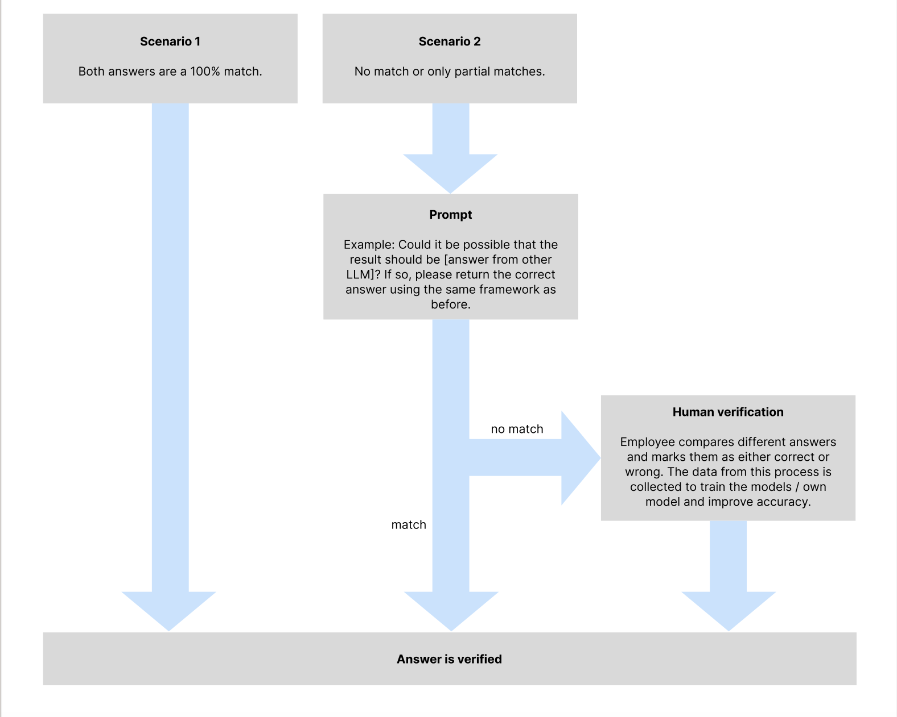

# Clearlea.se AI Trust Challenge

Welcome to the Clearlea.se AI Trust Challenge for Innodays! This repository is dedicated to our participation in the [Innodays AI Trust Challenge](https://www.innodays.org/challenge/ai-trust/).

## About the Challenge

In the digital age, building trust in AI-generated outputs is crucial, especially for businesses like chain stores and real estate investors. The accuracy and reliability of document processing can significantly impact decision-making and operational efficiency. The challenge presented by Clearlea.se is to enhance the trustworthiness of AI Document Processing (AIDP) systems.

### Key Objectives:
- **Enhance Efficiency:** Automate invoice processing, inventory management, customer record handling, and contract management for chain stores.
- **Improve Data Management:** Assist real estate investors with lease agreement extraction, property document processing, financial analysis, tenant application screening, and document storage and retrieval.
- **Build Trust:** Ensure that the AIDP system generates outputs that customers can trust unconditionally.

## Solution Approach

### Overview

Our solution focuses on developing a robust Quality Assurance and Output Validation framework within the Retrieval-Augmented Generation (RAG) system used by Clearlea.se's AIDP. The goal is to validate and enhance the trustworthiness of the AI-generated outputs through both machine-based and human-based methods

## Architecture

  
  

